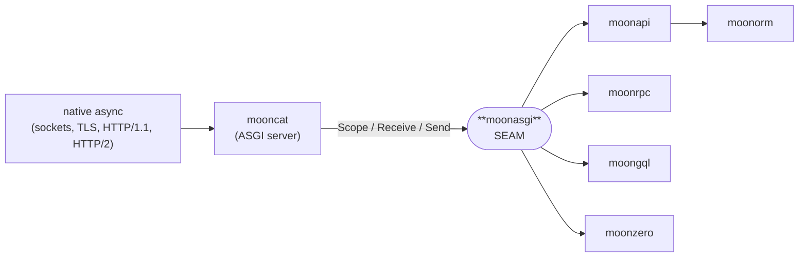

<div align="center">

# moonasgi

**MoonBit-dialect [ASGI 3.0](https://asgi.readthedocs.io/) — the load-bearing server↔app SEAM.**

[](https://github.com/Lfan-ke/moonasgi/actions/workflows/ci.yml)
[](./LICENSE)
[](https://mooncakes.io/docs/Lfan-ke/moonasgi)

</div>

`moonasgi` is the backend-agnostic protocol seam every server and framework in the **moon\*** full-stack suite is built around. One typed contract — `Scope` / `Receive` / `Send` — isolates async-transport churn in a single server adapter, so the framework repos (`moonapi`, `moonorm`, `moonrpc`, `moongql`, `moonzero`) never depend on `moonbitlang/async` directly.



## The contract

```moonbit
pub enum Scope {
  Http(HttpScope)
  WebSocket(WebSocketScope)
  Lifespan(LifespanScope)
}

pub type Receive = async () -> Event          // pull the next inbound event
pub type Send    = async (Event) -> Unit      // push an outbound event
pub type AsgiApp = async (Scope, Receive, Send) -> Unit
```

Applications are usually written against the ergonomic sugar, which the server lifts onto `AsgiApp`:

```moonbit
pub type Handler    = (Request) -> Response
pub type Middleware = (Handler) -> Handler
```

`Event` is a typed sum over the full http / websocket / lifespan message sets in both directions, replacing ASGI's stringly-typed message dicts.

## Design

- **Zero dependencies.** The seam is pure types plus a small sugar layer; the concrete `moonbitlang/async` transport types live only in the `mooncat` adapter. Async or backend churn stops at the seam (see the isolation contract).
- **Faithful, not approximate.** This is a complete transliteration of ASGI 3.0 into MoonBit idiom — the typed `Scope`/`Event` shape is the dialect, not a subset.

## Status

`v0` — the SEAM types are **frozen**: `Scope`, `Event`, `Receive`/`Send`/`AsgiApp`, `Request`/`Response`, `Handler`/`Middleware`, and pure header/middleware helpers, all warning-clean across backends. The async `Handler → AsgiApp` runtime adapter lands with `mooncat`, which owns the native async transport.

## License

Apache-2.0.
